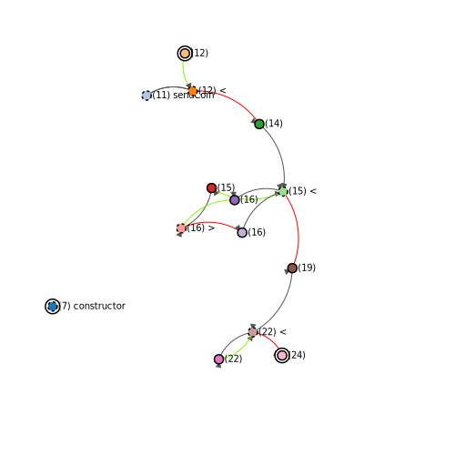

# The generated cfg.svg

Edges

- The edges have arrowheads pointing in the direction of the next branch.
- Grey edges indicate passthrough edges (edges that are not branches).
- Green edges indicate true branches.
- Red edges indicate false branches.

Nodes

- Next to each node the line number is given.
- Dashed nodes are root nodes, bassically a decision point.
- Nodes where comparisons happen have the comparison sign next to their line number.
- Nodes with double stroke indicate final nodes.
- Nodes that are function definitions have their function name next to them.
